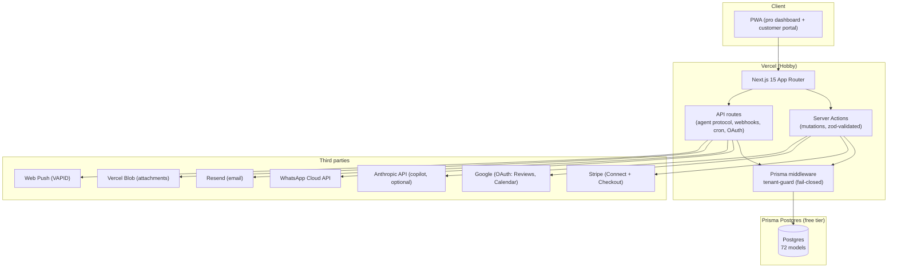

# EveryJob — Architecture

Modular monolith. One Next.js app serves the pro dashboard, customer portal, public pages (booking, directory, tracking), the agent API, and webhooks. No microservices.

## Component diagram



**Box notes**: Server Actions handle all authenticated mutations (each: `requireAuth()` → zod validation → tenant-scoped Prisma → `revalidatePath`). API routes serve the public/agent surface, OAuth callbacks, incoming webhooks (Stripe, WhatsApp), and cron triggers. The tenant-guard middleware sits between all Prisma access and the DB. Third parties are called directly from actions/routes — no queue.

## Stack

| Layer | Choice | Alternative rejected | Why |
|---|---|---|---|
| Framework | Next.js 15 App Router + TypeScript strict | Separate SPA + API | One deploy, server-rendered, colocated data fetching; solo-founder ops |
| ORM | Prisma | Drizzle | Schema-first, migrations, middleware support for the tenant guard |
| Database | Prisma Postgres (Vercel, free) | Supabase/Neon | Zero-config with Vercel deploy; tiny but free |
| Auth | Custom sessions (Prisma `Session`, `kivo_session` cookie, bcryptjs) | Clerk/Auth0 | $0; full control. **Risk**: hand-rolled session logic (see risks) |
| Styling | Tailwind CSS v4 + custom design tokens | Component library | Distinct charcoal/lime identity; no dependency weight |
| i18n | In-repo EN/FR dictionaries | next-intl | Full control over copy; Canada-only scope |
| File storage | `@vercel/blob` | S3/R2 | Zero-config. **Risk**: currently failing in prod, cause unknown |
| Push | Web Push (VAPID) | FCM | No vendor lock-in, free |

## Folder structure

```
src/
  app/
    (app)/            # pro dashboard routes (authenticated)
    (auth)/           # login/register
    customer/         # customer portal (separate session)
    api/              # agent/v1, v1 (REST), webhooks, cron, oauth, health
    a/[token]/        # agent proposal confirm page
    actions/          # Server Actions, one file per domain (jobs, invoices, …)
  lib/                # domain logic: tenant-guard, tax, money, validations,
                      # webhooks, agent-protocol, copilot/, i18n/, messaging/
  components/         # shared UI (ui.tsx design system) + feature components
  hooks/
  proxy.ts            # middleware (auth gating)
prisma/schema.prisma  # 72 models, migrations in prisma/migrations
public/skills/        # agent SKILL.md files (served statically)
```

Business logic lives in `src/lib/` and `src/app/actions/`; route handlers and components stay thin.

## Background work

There is **no job queue**. Background-ish work runs two ways:

1. **In-request, best-effort**: `emitWebhookEvent()` delivers immediately inline, then a cron retry sweep picks up failures. Never throws — failures are logged, not fatal.
2. **Cron routes** (`/api/cron/*`, guarded by `CRON_SECRET`): `messaging` (hourly automated-message trigger), `recurring` (recurring job generation), `workflows` (automation rules), `agent-purge` (expired proposal cleanup).

**Gap**: no durable queue — a deploy mid-delivery or a long third-party outage relies on the cron retry sweep. Acceptable at current scale; revisit with Inngest/Trigger.dev if delivery guarantees matter.

## Third-party services ($0)

| Service | Use | Cost |
|---|---|---|
| Vercel Hobby | Hosting, auto-deploy from GitHub main | $0 |
| Prisma Postgres free | `kivo-db`, role `prisma_migration`, tiny connection cap | $0 |
| Vercel Blob | Attachments, logos | $0 (currently broken in prod) |
| Stripe | Connect (payouts to pro's account), Checkout, webhooks | $0 until volume; fees per transaction |
| Google OAuth | Sign-in, Reviews (Business Profile API), Calendar sync | $0 |
| WhatsApp Cloud API | Messaging (quota-guarded) | $0 / Meta free tier |
| Resend | Transactional email | $0 free tier |
| Anthropic API | Copilot AI answers (optional; rule engine fallback) | $0 unless key set |
| Web Push VAPID | PWA notifications | $0 |

## 3 riskiest decisions

1. **Hand-rolled session auth** instead of a proven provider. Sessions are DB-backed with expiry, but password/reset/session-revocation logic is custom — the classic place for subtle bugs. Mitigated by bcryptjs and keep-it-simple flows; a migration to Auth.js remains an option.
2. **No staging environment.** Production is the only target; every push auto-deploys. Mitigated by 847 unit tests + per-control live QA, but a bad migration or env change hits real users immediately.
3. **Prisma Postgres free-tier connection cap.** The `prisma_migration` role allows very few concurrent connections; bursts (cold starts, rapid taps) exhaust it. Mitigated in depth (`connection_limit=1`, cached client, `db-retry` on init failures only). If traffic grows, this is the first thing that breaks — and the first thing money fixes.
